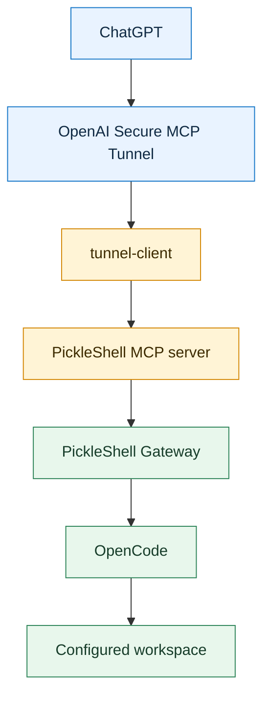
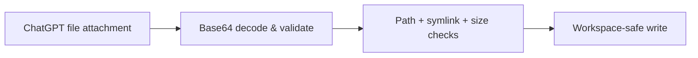
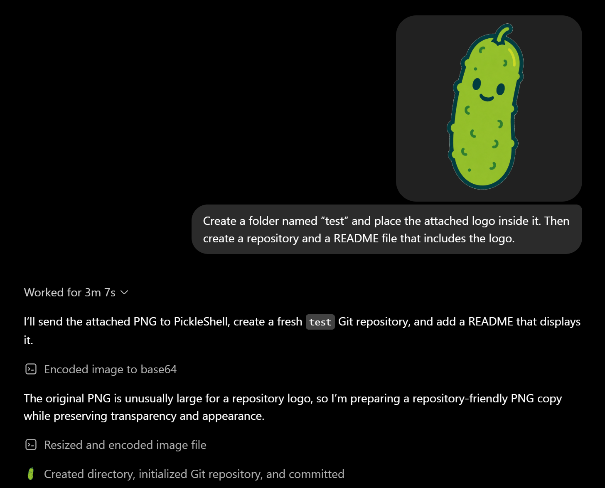

<h1 align="center">
  
  PickleShell
</h1>

<p align="center"><strong>Give ChatGPT a local machine to work with</strong></p>

[](#release-history)
[](#development)
[](LICENSE)
[](#requirements)

**Website:** [pickleshell.github.io](https://pickleshell.github.io/)

> Want to give your ChatGPT a gift? Give it PickleShell.

PickleShell connects ChatGPT to an [OpenCode](https://opencode.ai/) agent
running on your machine. ChatGPT can inspect repositories, edit files, run
tests, transfer small files, and coordinate long-running tasks. The connection
uses an outbound-only OpenAI Secure MCP Tunnel, while execution remains inside
your selected workspace.

ChatGPT delegates work through four MCP tools—`send-chat`, `session-status`,
`session-output`, and `cancel-request`—and receives structured results with
full traces. Continue local coding sessions, delegate to an operator-approved
model, and transfer files into a controlled workspace.

## What PickleShell Is For

PickleShell solves a practical problem: ChatGPT can analyze tasks, but it
normally cannot work directly with a local repository.

Through PickleShell, ChatGPT sends instructions and small files to a local
OpenCode agent, follows the execution, reads the result, and can continue in
the same session when it passes the session ID.

The agent runs on your machine, inside a selected workspace, through a
protected outbound-only tunnel. PickleShell removes the human relay between
ChatGPT and OpenCode, while you remain the owner and observer.

PickleShell is for developers and experienced users. Installation is designed
to be guided by Codex: ask it to clone the repository, read `AGENTS.md`, and
walk you through the setup step by step using
[`docs/deployment.md`](docs/deployment.md) and
[`docs/chatgpt.md`](docs/chatgpt.md). `AGENTS.md` is the contributor guide for
the development workflow, architecture, security invariants, and change
boundaries.

## Use Case

Create three PickleShell tunnels to three different machines, then give the
plugins unique names: `PickleShell Mars`, `PickleShell Moon`, and
`PickleShell Starbase`. The first tunnel connects to a machine on Mars, the
second to a machine on the Moon, and the third to a machine at Starbase. Tell
your ChatGPT Assistant which named plugin belongs to which machine, and it can
route each task to the right destination.

With this setup, your ChatGPT Assistant can manage colonies on Mars and the
Moon, as well as coordinate launches from Starbase to them—the big rockets Elon
launches. The same pattern is useful today for everything from saving a
technical specification to asking the OpenCode agent on a selected machine to
carry out a complex task directly from ChatGPT.

> [!WARNING]
> **PickleShell is pre-release software (`0.1.0`).** Use it only with trusted
> users and a dedicated service account. Read
> [SECURITY.md](SECURITY.md) before deployment.

## Quick Start

1. Follow the [Deployment guide](docs/deployment.md) to install the Gateway and
   tunnel-client on a Linux host.
2. Follow the [ChatGPT setup](docs/chatgpt.md) to create the Secure MCP Tunnel,
   configure the PickleShell plugin, and run the connection test.
3. Send a test message: `Reply exactly: pong. Do not use tools or modify files.`
4. Poll `session-status` until `state: "completed"`, then read the result with
   `session-output`.

## Why PickleShell?

ChatGPT can reason about a project, while OpenCode can operate inside a local
development environment. PickleShell provides the secure, explicit boundary
between them:

- no public Gateway endpoint;
- no inbound port forwarding;
- operator-controlled workspaces and model allowlists;
- authenticated requests and auditable local execution;
- file transfer with path, symlink, and overwrite protection;
- workspace isolation that prevents cross-chat state mixing.

## Architecture



The tunnel is initiated from the local machine over outbound HTTPS. The Gateway
remains reachable only inside the trusted local environment.

## Async Workflow

`send-chat` returns immediately with a `request_id` and `state: "busy"`. Poll
`session-status` to track progress, then read the result with `session-output`.
Cancel in-flight work with `cancel-request` at any time.

```
send-chat ──▸ { request_id, state: "busy", next_action: "session-status" }
                    │
                    ▼
              session-status ──▸ { state: "busy", progress: [...] }
                    │                retry_after_ms: 2000
                    ▼
              session-status ──▸ { state: "completed", next_action: "session-output" }
                    │
                    ▼
              session-output ──▸ { reply, trace, session_id, timestamps }
```

Each response includes `next_action` (which tool to call next) and
`retry_after_ms` (suggested polling interval). Pass the returned `session_id` in
subsequent `send-chat` calls to continue the same OpenCode conversation. Omit it
to start a fresh session that runs independently and in parallel.

**Idempotency:** when a client provides an explicit idempotency key, duplicate
`send-chat` requests are detected and the original result is returned instead of
re-executing the command.

**Completed results** are retained for 24 hours and can be read repeatedly
through `session-output`.

**Session locking:** concurrent `send-chat` requests to the same explicit
`session_id` receive a `409 session_busy` response. Independent sessions run in
parallel without interference.

## File Transfer





| Constraint | Limit |
| --- | --- |
| Files per request | 20 |
| Size per file | 2 MiB |
| Total payload | 10 MiB |
| Overwrite | Disabled by default; explicit opt-in per file |

Destination resolution: `files[].dest_dir` > `destination_dir` > `.inbox/<request-id>/`.

The Gateway writes through directory file descriptors with `O_NOFOLLOW`, rejects
symbolic links as destinations, and publishes results atomically.

## Capabilities

| Capability | Behaviour |
| --- | --- |
| Async execution | Non-blocking tasks with `request_id` tracking and structured polling |
| Session continuity | Continue an OpenCode conversation across multiple ChatGPT messages using `session_id` |
| Cancellation | Abort in-flight tasks with `cancel-request` |
| Model selection | Choose only from an operator-controlled model allowlist |
| File transfer | Transfer up to 20 files per request with size, path, symlink, and overwrite protection |
| Destination control | Place files in an explicit workspace-relative directory |
| Session locking | Reject concurrent work on the same explicit session |
| Parallel work | Run independent sessions concurrently without state mixing |
| Structured metadata | Timestamps (`created_at`, `started_at`, `completed_at`), `queue_ms`, `execution_ms`, and full execution traces in every completed result |

## Security Model

PickleShell is a controlled bridge to a local coding agent, not a
general-purpose public shell. Deployments should use a dedicated unprivileged
service account, strict workspace permissions, a narrow model allowlist, and
environment-backed credentials.

See [SECURITY.md](SECURITY.md) for the trust model, file-delivery invariants,
availability guarantees, and vulnerability reporting.

## Requirements

- Linux;
- Node.js 20 or newer;
- OpenCode installed and configured;
- OpenAI Secure MCP Tunnel access;
- a dedicated local service account is strongly recommended.

## Development

Install dependencies, run the complete test suite, build both components, and
audit dependencies:

```bash
npm --prefix gateway ci
npm --prefix mcp-server ci
npm test
npm run build
npm run audit
```

## Documentation

- [ChatGPT setup](docs/chatgpt.md) — connect the plugin and run the connection test
- [Deployment guide](docs/deployment.md) — install the Gateway, tunnel, and systemd units
- [API reference](docs/api.md) — MCP tool schemas, async protocol, and Gateway endpoints
- [Security policy](SECURITY.md) — trust model, threat boundaries, and vulnerability reporting
- [Roadmap](docs/roadmap.md) — v1 production checklist and deferred features

## Contact

Open a GitHub issue to report a bug, suggest an improvement, or ask for help.
Include the relevant setup details and steps to reproduce the problem.

- [Create an issue](https://github.com/pickleshell/pickleshell/issues/new)
- [Browse existing issues](https://github.com/pickleshell/pickleshell/issues)
- Email: [pickleshell.plugin@gmail.com](mailto:pickleshell.plugin@gmail.com)

## Project Status

PickleShell `0.1.1` is the latest release. It adds the Playwright browser
runtime and browser automation documentation, hardens agent isolation and
service runtime security, and updates the ChatGPT Assistant setup and product
documentation.

This is pre-1.0 software. Interfaces may change before a stable `1.0` release.

## Release History

### [v0.1.1](https://github.com/pickleshell/pickleshell/releases/tag/v0.1.1)

- Added Playwright MCP browser automation runtime and setup documentation.
- Hardened agent isolation, authentication, and systemd service runtime.
- Updated ChatGPT Assistant positioning, plugin setup, and async workflow docs.
- Added project contact guidance and release metadata.

### [v0.1.0](https://github.com/pickleshell/pickleshell/tree/v0.1.0)

- First production-ready release.
- Added asynchronous `request_id` execution with status polling and full output.
- Added session continuity, cancellation, explicit idempotency, file transfer,
  structured metadata, and operator-controlled workspace/model scoping.

## Authors

- Me
- Big Pickle
- Codex
- Grok
- ChatGPT

## License

PickleShell is available under the [MIT License](LICENSE).
