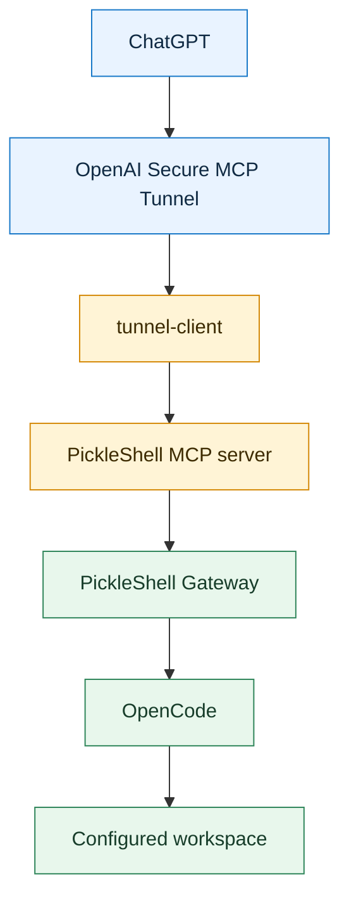
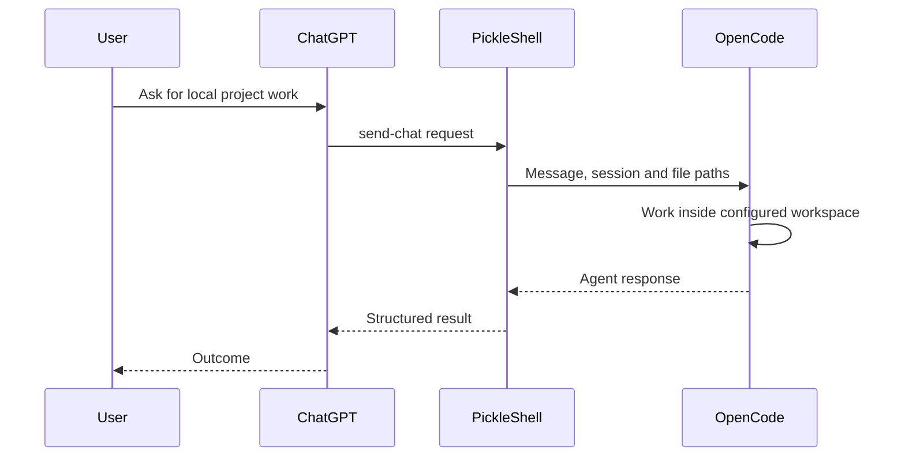

<h1 align="center">
  
  PickleShell
</h1>

<p align="center"><strong>Give ChatGPT a secure path to your local OpenCode agent</strong></p>

[](#project-status)
[](#development)
[](LICENSE)
[](#requirements)

PickleShell connects ChatGPT to a locally operated
[OpenCode](https://opencode.ai/) agent through an outbound-only OpenAI Secure
MCP Tunnel. Your agent Gateway stays off the public Internet.

Use it to continue local coding sessions, delegate work to an operator-approved
model, and transfer small files into a controlled workspace—all through one MCP
tool.

> [!WARNING]
> **PickleShell is currently pre-release software (`0.1.0`).** Use it only with
> trusted users and a dedicated service account. Read
> [SECURITY.md](SECURITY.md) before deployment.

## Why PickleShell?

ChatGPT can reason about a project, while OpenCode can operate inside a local
development environment. PickleShell provides the secure, explicit boundary
between them:

- no public Gateway endpoint;
- no inbound port forwarding;
- operator-controlled workspaces and model allowlists;
- authenticated requests and auditable local execution;
- file transfer with path, symlink, and overwrite protection.

## Architecture



The tunnel is initiated from the local machine over outbound HTTPS. The
Gateway remains reachable only inside the trusted local environment.

### Request flow



## Capabilities

| Capability | Behaviour |
| --- | --- |
| Session continuity | Continue an OpenCode conversation using `session_id` |
| Model selection | Choose only from an operator-controlled model allowlist |
| File transfer | Transfer up to 20 small files per request |
| Destination control | Place files in an explicit workspace-relative directory |
| Path safety | Reject traversal, absolute paths and symlink destinations |
| Overwrite safety | Prevent unintended replacement of existing files |
| Session locking | Reject concurrent work on the same explicit session |
| Parallel work | Run independent sessions concurrently |

## Repository layout

```text
.
├── gateway/       # Authenticated HTTP service that runs OpenCode
├── mcp-server/    # MCP send-chat adapter and Base64 file decoder
├── docs/          # Deployment, API and ChatGPT setup guides
├── SECURITY.md    # Security policy and threat model
└── README.md
```

PickleShell deliberately separates its two interfaces:

- **MCP `send-chat`** is the public tool contract used by ChatGPT. It accepts
  messages, session metadata and optional Base64-encoded files.
- **Gateway `POST /chat`** is an internal contract used by the MCP server. It
  receives validated local `file_paths`, not public file payloads.

See the [API reference](docs/api.md) for the complete schemas.

## Requirements

- Linux;
- Node.js 20 or newer;
- OpenCode installed and configured;
- OpenAI Secure MCP Tunnel access;
- a dedicated local service account is strongly recommended.

## Development

Install dependencies, run the complete test suite, build both components, and
audit dependencies:

```bash
npm --prefix gateway ci
npm --prefix mcp-server ci
npm test
npm run build
npm run audit
```

## Security model

PickleShell is a controlled bridge to a local coding agent—not a general-purpose
public shell.

Its file-transfer boundary is designed to reject:

- absolute paths and `..` traversal;
- path components that resolve through symbolic links;
- symbolic links used as final destinations;
- writes outside the configured workspace;
- overwrites unless explicitly allowed.

Deployments should additionally use a dedicated service account, strict
workspace permissions, a narrow model allowlist, and environment-backed
credentials.

For deployment assumptions, threat boundaries and vulnerability reporting, see
[SECURITY.md](SECURITY.md).

## Documentation

- [Deployment guide](docs/deployment.md)
- [API reference](docs/api.md)
- [ChatGPT setup](docs/chatgpt.md)
- [Security policy and threat model](SECURITY.md)

## Project status

PickleShell `0.1.0` is a pre-release intended for controlled testing. Its
interfaces may change before the first stable release.

Bug reports and focused pull requests are welcome once the public repository is
available.

## License

PickleShell is available under the [MIT License](LICENSE).
