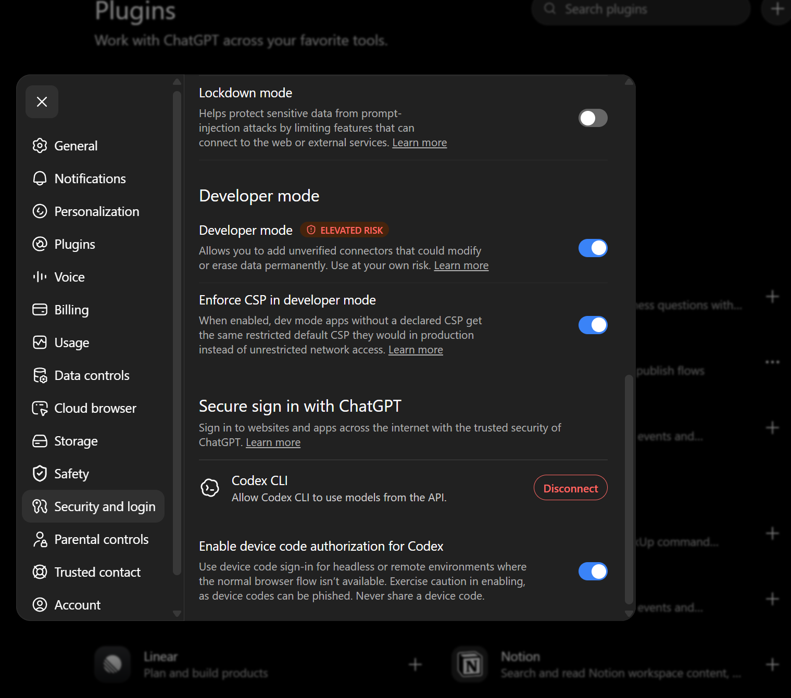
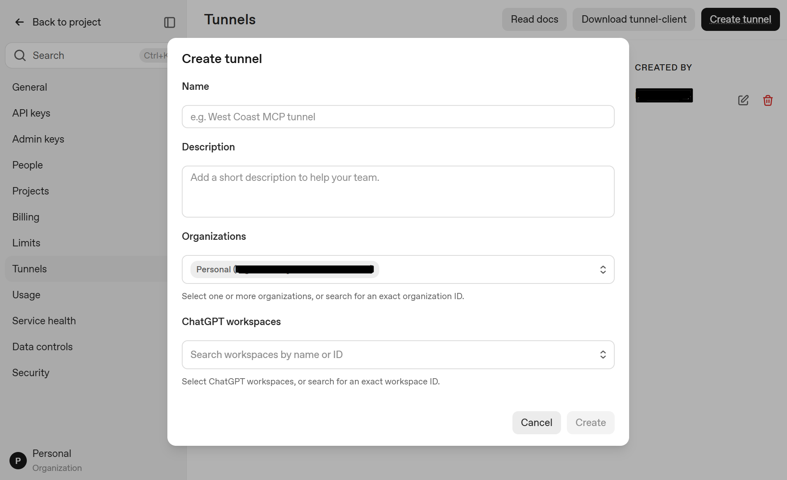
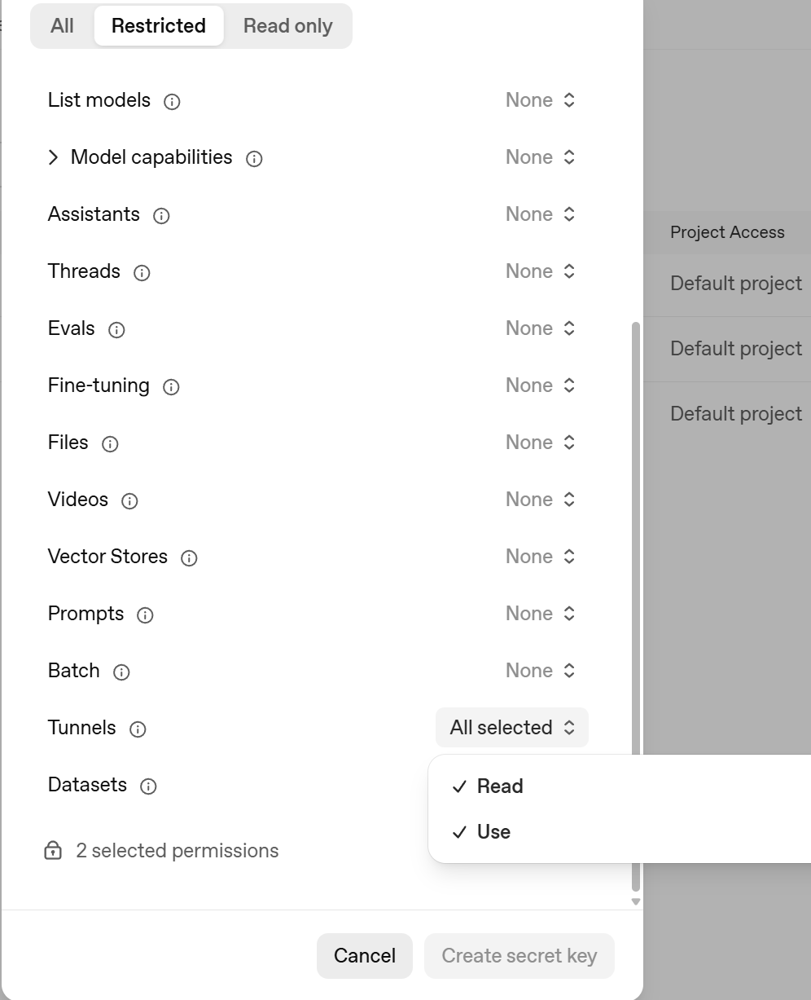
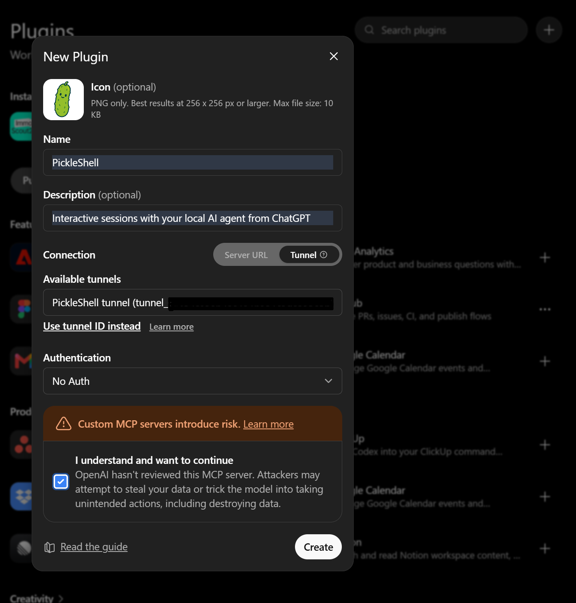
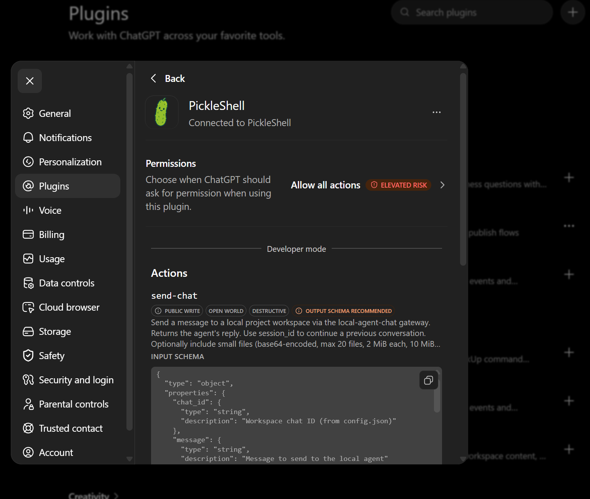

# Connect ChatGPT

This guide walks through every UI step from enabling developer mode to testing
PickleShell in ChatGPT.

## Prerequisites

- an OpenAI account and workspace that support custom MCP apps;
- Developer mode enabled;
- a Secure MCP Tunnel created in the OpenAI Platform;
- `tunnel-client` running on the PickleShell host.

## Identifier terminology

| Identifier | Meaning |
|---|---|
| `chat_id` | Workspace/configuration identifier (maps to a directory on disk) |
| `session_id` | Real OpenCode conversation identifier (`ses_...`), used to continue context |
| `request_id` | Single command execution identifier (`req_...`), returned by send-chat |

## 1. Enable Developer mode

1. Open **Settings → Security and login**.
2. Enable **Developer mode**.
3. Leave **Enforce CSP in developer mode** enabled for additional protection.



## 2. Create a Secure MCP Tunnel

1. Go to **OpenAI Platform → project settings → Tunnels**.
2. Click **Create tunnel**.
3. Enter a descriptive name and description.
4. Select the organization and the permitted ChatGPT workspace.
5. Create the tunnel.



> **Warning:** Treat the Tunnel ID, organization ID, and workspace ID as
> private configuration values. Do not publish them.

## 3. Create a restricted tunnel key

1. In the OpenAI Platform, create a **restricted project secret key**.
2. Leave unrelated permissions at **None**.
3. Grant only **Tunnels: Read** and **Tunnels: Use**.



> **Warning:** Copy the secret immediately. Never commit, screenshot, log, or
> publish it. Store it in the protected configuration described by
> [deployment.md](deployment.md).

## 4. Start the local tunnel

See [Deployment](deployment.md) for installation commands. The `tunnel-client`
and the PickleShell services must both report healthy/ready before continuing.

## 5. Create the PickleShell plugin

In ChatGPT, open **Plugins** and press **+** to add a new plugin. Name it
`PickleShell`, select the configured tunnel, and allow all four MCP tools:
`send-chat`, `session-status`, `session-output`, and `cancel-request`.



## 6. Verify the connected plugin

The connected PickleShell entry should show the selected tunnel and the four
enabled MCP tools.



## 7. Refresh after schema changes

After changing the MCP schema:

1. Open the PickleShell plugin from **Plugins**;
2. Press **Refresh**;
3. Review the updated tool schema;
4. Enable the updated tools if ChatGPT asks;
5. Start a new conversation.

The connected plugin should expose `send-chat`, `session-status`,
`session-output`, and `cancel-request`. If Refresh completes but the old schema
still exposes only `send-chat`, do a full connector reset: remove the
PickleShell plugin/connector, create it again using the current PickleShell
tunnel, and open a new conversation. A new chat alone is not sufficient when
ChatGPT has retained the old connector registration.

## 8. Test the connection

Test:

```text
Use PickleShell.
chat_id: pickleshell-main
message: Reply with exactly: pong. Do not use tools or modify files.
```

The response includes `request_id` and `state: "busy"`. Use `session-status`
with the `request_id` to poll progress, then `session-output` to read the reply.

For continued work, pass the `session_id` from the session-output response. Use
a different session for unrelated work.

## 9. Plugin tool smoke test

Use this checklist in a fresh ChatGPT conversation after the initial `pong`
test. All messages below target `chat_id: pickleshell-main` and must not edit
files.

1. Call `send-chat` with: `Reply exactly: PONG_TEST. Do not use tools or modify files.`
   Save the returned `request_id` and `session_id`.
2. Call `session-status` with the `request_id`. Expect `state: "busy"`.
3. Poll `session-status` until `state: "completed"`.
4. Call `session-output` with the `request_id`. Confirm it returns `PONG_TEST`
   and a `trace`.
5. Call `send-chat` again with the same `session_id`: `Reply exactly: SECOND_TEST. Do not use tools or modify files.`
6. Call `session-output` with the new `request_id`. Confirm it returns
   `SECOND_TEST`, not `PONG_TEST`.

To test cancel:

1. Call `send-chat` with: `Wait 30 seconds, then reply exactly: CANCEL_TEST. Do not use tools.`
2. Call `cancel-request` with the `request_id`. Expect `status: "cancelled"`.
3. Call `session-output` with the `request_id`. Expect error or partial output.

The expected tool sequence is:

```text
send-chat -> session-status (poll) -> session-output
          -> send-chat -> session-output
          -> send-chat -> cancel-request -> session-output
```

Receiving `409 session_busy` (state: "rejected") during a race is expected;
use `next_action: "session-status"` and `retry_after_ms` from the response
to wait and retry.

## 10. Async chat smoke test

Use this test after the provider is available. Set `chat_id` to
`pickleshell-main` and do not attach files.

1. Call `session-status` without `session_id`. Expect `state: "new_session"`.
2. Call `send-chat` without `session_id` with:
   `Reply exactly: ASYNC_PONG. Do not use tools or modify files.`
3. Confirm that `send-chat` returns immediately with `state: "busy"`, a
   non-empty `request_id`, and `session_id: null`.
4. Poll `session-status` using that `request_id` every 2–5 seconds. It must
   report `state: "busy"` while running, then `state: "completed"`.
5. Call `session-output` with the same `request_id`. Confirm `output.reply`
   is `ASYNC_PONG`, `output.trace` is present, and save
   `output.session_id` if it is non-null.
6. If a real `output.session_id` was returned, call `send-chat` with that ID:
   `Reply exactly: ASYNC_CONTINUED. Do not use tools or modify files.`
   Poll its new `request_id`, then read the result with `session-output`.

Expected async sequence:

```text
send-chat (busy + request_id)
  -> session-status(request_id) [busy ... completed]
  -> session-output(request_id) [reply + trace + session_id]
  -> optional continuation with returned ses_... ID
```

If the completed output contains `output.error` such as `No provider
available (401)`, the async transport is working and the failure is in the
OpenCode provider/authentication layer. Do not treat that result as a
Gateway or MCP workflow failure.
